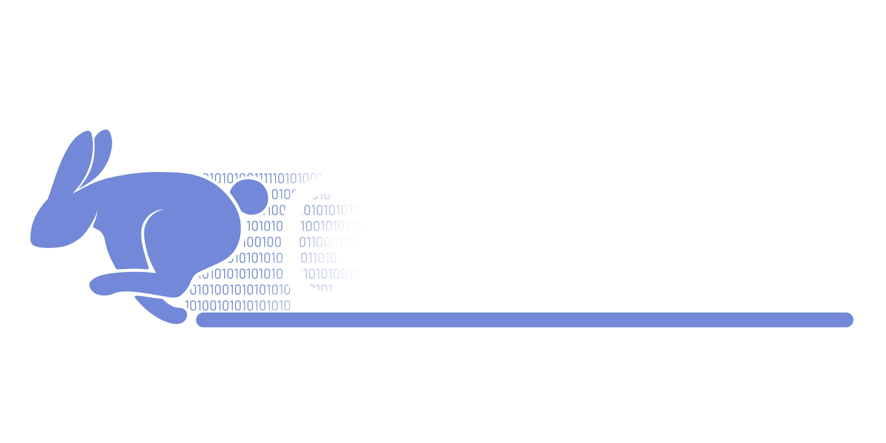

dOSC is a dynamic OSC app sharing platform with the goal of allowing users to create, run, and distribute apps that can be configured to interact with avatars in VRChat.

# Note: This project is under development and currently in a `Beta` state. 

## Features:

- Quickly build and debug code in a node-based editor
- Share and distribute apps on a common platform
- Run OSC apps in parallel (No more one off apps!)
- Program your apps in real-time! No more compiling.

## Integrations Implemented:
- Pulsoid
- OSC

## Github 
See dOSC development [here](https://github.com/Duinrahaic/dOSC/)

## Download 
Get dOSC from [here](https://github.com/Duinrahaic/dOSC/releases)

## Project Board
For details on Features voted on by the supporters you can find them [here](https://github.com/users/Duinrahaic/projects/1)

## Feature Request 
Feature and Enhancement requests are tied to my patreon *however* if you feel diligent and would like to make a pull request yourself I'll be happy to add that functionality.

## Discord
Join the discord [here](https://discord.gg/aZQfy6H9fA)
