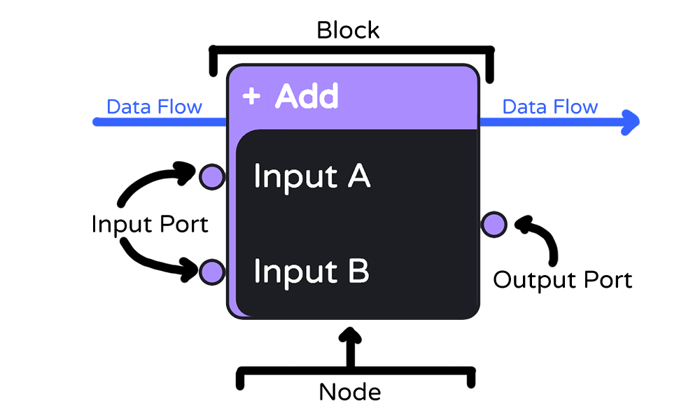

# Custom Block Creation


## Table of Contents
- [Content Overview](#ContentOverview)
- [Ports](#Ports)
- [Links](#Links)
- [Nodes](#Nodes)
- [Blocks](#Blocks)
- [Registering Blocks](#RegisteringBlocks)
- [Handling Serialization](#HandlingSerialization)
- [Add To Editor](#AddToEditor)

<a id="ContentOverview"></a>
## Content Overview



Blocks are broken up into 3 components:
- `Block`: The visualization and UI. 
- `Node`: The processor. Has full knowledge of the ports and how
- `Port`: Handles relationships and connections between other blocks. 

Connections are made through a `Link`

<a id="Ports"></a>
## Ports
### Overview
The ports are the primary handler for handling relationships and processing the data flow. All data is handled in by input `ports` and presented out through an output `port`.

Currently there are two available `port` types: 
- __Numeric__: This represents numbers such as *int*, *doubles*, and *floats*.
- __Logic__: This represents Booleans such as *true* and *false*

### Port Behaviors
Ports are either as an *input* or an *output* `port`. Data flows from output `ports` and into one or many input `ports`. When a `link` is created between two or more `ports`, then data will begin to flow from the output `port` into the input `port`. `Ports` are configured within a `Node`.

The following parameters are configured with each port:

| Parameter | Description |Note |
| ------------- | ------------- | ------------- |
| **Port GUID**  | The unique identifier of the port | No port within a node should have the same GUID  |
| **Input**  | If *true* then the port is configured as an input. Otherwise if *false* then the port is treated as an output port |   |
| **Limit Link**  | If *false* an input port will allow multiple outputs, otherwise only one connection can be made. | Output ports ignore this configuration   |


> [!NOTE]
>  If no `Links` are made to a `Port`, the value will be rendered as 'null'.

<a id="Links"></a>
## Links
`Links` direct data flow between two ports. Currently there are no configurations for links.

<a id="Nodes"></a>
## Nodes
### Overview

`Nodes` process the information given to them by the `ports` that are defined within it. Each node will need the following described to it:

- What port exist for a given block
- How Information is processed in each block

### Custom Node Example
Using the `AddNode` as an example, we create two constructors: One for a new node and one for an existing node. 

A **New** Node will not be supplied with a GUID and will be auto generated.

If a **Existing** Node is being loaded, then it will be supplied with a GUID

Within each of the constructors we use `AddPort` to insert `Ports` into the Node. In the following example we add two input ports (Port_1 and Port_2) and declare them using the constructor for the type of port we want to use. In this case we used Numeric ports. Lastly we defined an output port - this will be where we can export the data from the node. 

```cs 
public class AddNode : BaseNode
{
    public AddNode(Point? position = null) : base(position ?? new Point(0, 0)) // Constructor for a new node
    {
        AddPort(new NumericPort(PortGuids.Port_1, this, true)); // Defines an Input Port A with a GUID of Port 1
        AddPort(new NumericPort(PortGuids.Port_2, this, true)); // Defines an Input Port B with a GUID of Port 2
        AddPort(new NumericPort(PortGuids.Port_3, this, false)); // Defines an Output Port with a GUID of Port 3
    }
    public AddNode(Guid guid, Point? position = null) : base(guid, position ?? new Point(0, 0)) // Constructor for an existing node
    {
        AddPort(new NumericPort(PortGuids.Port_1, this, true)); // Defines an Input Port A with a GUID of Port 1
        AddPort(new NumericPort(PortGuids.Port_2, this, true)); // Defines an Input Port B with a GUID of Port 2
        AddPort(new NumericPort(PortGuids.Port_3, this, false)); // Defines an Output Port with a GUID of Port 3
    }
    [JsonProperty]
    public override string NodeClass => GetType().Name.ToString(); // used for serialization
    public override string BlockTypeClass => "numericblock"; // defines block color. "numericblock" and "logicblock" exist currently.

    public override void CalculateValue()
    {
        // This is where you write your logic for code processing
    }
}
```

When a `Value` of a `node` is updated, any port connected to the `output port` will trigger the method  `CalculateValue`. This method typically used to update the `Value` of a `Node`. For the example above, our objective is to add two numbers together. 

The general process of most nodes is the following:

- Get ports
- Check if ports have links
- Get the values of the ports if they have links
- Handle edge-cases
- Set the value of the node

Here is the logic for an adding two numbers together. Note that I handle 3 cases in this method: 
- If both ports have links
- If only port A has a link
- If only port B has a link

```cs
public override void CalculateValue()
{
    var i1 = Ports[0]; // Get Port A
    var i2 = Ports[1]; // Get Port B

    if (i1.Links.Any() && i2.Links.Any()) // If both have links associated with it
    {
        var l1 = i1.Links[0]; // Get first link associated with input A
        var l2 = i2.Links[0]; // Get first link associated with input B
        var v1 = GetInputValue(i1, l1); //Get the value for input A
        var v2 = GetInputValue(i2, l2); //Get the value for input B
        Value = v1 + v2; // Set Value to the sum of A and B
    }
    else if (i1.Links.Any()) 
    {
        var l1 = i1.Links[0]; // Get first link associated with input A
        var v1 = GetInputValue(i1, l1); //Get the value for input A
        Value = v1; // Set Value to the value of A
    }
    else if (i2.Links.Any())
    {
        var l2 = i2.Links[0]; // Get first link associated with input B
        var v2 = GetInputValue(i2, l2); //Get the value for input B
        Value = v2; // Set Value to the value of A
    }
    else
    {
        Value = 0; // If no links exist then set Value to 0
    }
}
```


<a id="Blocks"></a>
## Blocks
### Overview

Blocks are constructed using Razor pages. Razor pages are mixture of C#, HTML, and CSS. For the example we are going to construct 

```cs
@using Blazor.Diagrams.Components.Renderers
@using dOSCEngine.Engine.Helper
@using dOSCEngine.Engine.Nodes.Math;
@using Microsoft.AspNetCore.Components;

<div class="@this.Node.BlockHeaderClass" style="width: 150px;"> @* Set the width in pixels*@
    <div class="block-header d-flex d-inline">
        <div class="icon">+</div> @* Give it an icon (Optional)*@
        <div class="title">Add</div> @* Give it a name*@
    </div>
    <div class="block-body">
        <div class="d-flex flex-column">
            <div class="d-flex d-inline p-1 align-items-center justify-center">
                <PortRenderer Class="numeric" Port="this.Node.Ports[0]" /> @*Build Port A*@
                <h5>Input A</h5>
            </div>
            <div class="d-flex d-inline align-items-center justify-center-end py-2">
                <PortValueLabel LabelPosition=PortValueLabel.Position.Right DisplayValue="this.Node.Value" /> @*Build an output port and give it text over the port  *@
                <PortRenderer Class="numeric" Port="this.Node.Ports[2]" />
            </div>
            <div class="d-flex d-inline p-1 align-items-center justify-center">
                <PortRenderer Class="numeric" Port="this.Node.Ports[1]" /> @*Build Port B*@
                <h5>Input B</h5>
            </div>
        </div>
    </div>
</div>
 
 
@code
{
   [Parameter] public AddNode Node { get; set; } = null; //Give this component an input parameter of the AddNode we constructed
}
```


<a id="RegisteringBlocks"></a>
## Registering Blocks


<a id="HandleSerialization"></a>
## Handling Serialization

<a id="AddToEditor"></a>
## Add To Editor